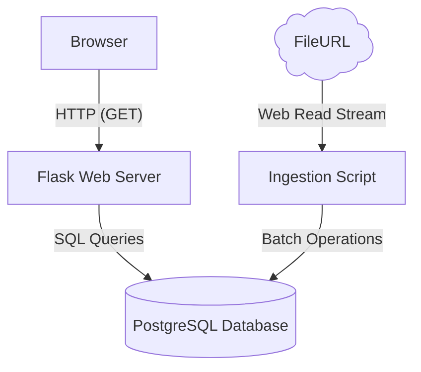

# VinAudit – CarValue Trial Project

**Design Document**

**Tech Stack:** Python (Flask), PostgreSQL  
**Purpose:** Internal market value estimation tool

---

## 1. Objective

The goal of this project is to build a **simple internal web interface** that estimates the **average market value** of a vehicle based on historical listings.

### User Inputs

- **Required:** Year + Make + Model (e.g., `2015 Toyota Camry`)
- **Optional:** Mileage (e.g., `150,000 miles`)

### Output

- Estimated market price (rounded to the nearest \$100)
- Up to **100 comparable listings** used in the calculation

---

## 2. System Architecture



### Components

- Flask application (routes, templates)
- PostgreSQL database
- One-time batch data ingestion script
- Server-rendered HTML templates (no frontend framework)

---

## 3. Input Data & Ingestion

### 3.1 Data File Format

The Full Market Data file is a **pipe-delimited (`|`) text file**:

```
vin|year|make|model|trim|dealer_name|dealer_street|dealer_city|dealer_state|dealer_zip|listing_price|listing_mileage|used|certified|style|driven_wheels|engine|fuel_type|exterior_color|interior_color|seller_website|first_seen_date|last_seen_date|dealer_vdp_last_seen_date|listing_status
```

---

### 3.2 Ingestion Strategy

1. Read file or url line-by-line using Python
2. Parse and validate required fields:
   - year, make, model
   - listing_price
   - listing_mileage
3. Normalize text fields (trim, uppercase make/model)
4. Insert data into PostgreSQL

### Why Batch Ingestion?

- File can be large
- Data is static after import
- Optimized for query performance during valuation

---

## 4. Database Schema

### 4.1 `vehicles`

Stores unique vehicle definitions.

| Column         | Type      |
| -------------- | --------- |
| vin            | TEXT (PK) |
| year           | INTEGER   |
| make           | TEXT      |
| model          | TEXT      |
| trim           | TEXT      |
| style          | TEXT      |
| driven_wheels  | TEXT      |
| engine         | TEXT      |
| fuel_type      | TEXT      |
| exterior_color | TEXT      |
| interior_color | TEXT      |

---

### 4.2 `dealers`

Stores dealer information.

| Column  | Type        |
| ------- | ----------- |
| id      | SERIAL (PK) |
| name    | TEXT        |
| street  | TEXT        |
| city    | TEXT        |
| state   | TEXT        |
| zip     | TEXT        |
| website | TEXT        |

---

### 4.3 `listings`

Stores individual vehicle listings used for valuation.

| Column          | Type                      |
| --------------- | ------------------------- |
| id              | BIGSERIAL (PK)            |
| vin             | TEXT (FK → vehicles.vin)  |
| dealer_id       | INTEGER (FK → dealers.id) |
| price           | NUMERIC                   |
| mileage         | INTEGER                   |
| used            | BOOLEAN                   |
| certified       | BOOLEAN                   |
| first_seen_date | DATE                      |
| last_seen_date  | DATE                      |
| listing_status  | TEXT                      |

---

### 4.4 Indexing Strategy

To ensure fast queries:

- `(year, make, model)`
- `(price)`
- `(mileage)`
- `(listing_status)`
- `(last_seen_date)`

---

## 5. Market Value Estimation Algorithm

### 5.1 Base Estimate (No Mileage Input)

1. Filter listings by:
   - Same year
   - Same make
   - Same model
2. Remove outliers:
   - Top and bottom 5–10% by price
3. Fit a **linear regression** of price vs. mileage on the trimmed set
4. Predict price at the **mean mileage** of the trimmed set
5. Round result to the nearest \$100

This preserves the requirement that market value is derived from **comparable listings**, while using mileage to shape the trend.

---

### 5.2 Mileage-Adjusted Estimate (Optional Input)

Mileage has a **negative correlation with price**.

#### Steps

1. Use the same trimmed set of comparable listings
2. Fit a linear regression:
   ```
   price = intercept + slope * mileage
   ```
3. Predict price at the **input mileage**
4. Round result to the nearest \$100

This approach is:

- Simple
- Explainable
- Deterministic

---

## 6. Flask API & Web Routes

### 6.1 Routes

#### `GET /`

- Renders search form
- Inputs:
- Year
- Make
- Model
- Mileage (optional)

---

#### `POST /estimate`

- Runs valuation logic
- Returns:
- Estimated market value
- Up to 100 comparable listings

---

### 6.2 Service Layer

- **ImportService**
  - Parses and inserts data
- **ListingRepository**
  - Queries comparable listings
- **ValuationService**
  - Fits regression on trimmed comps
  - Predicts at input/mean mileage
  - Handles rounding and filtering

---

## 7. User Interface

### Search Page

- Clean HTML form
- Server-rendered
- Proper alignment and spacing

### Results Page

- Highlighted estimated market value
- Table of comparable listings:

| Vehicle | Price | Mileage | Location |
| ------- | ----- | ------- | -------- |

---

## 8. Integration Tests

### 8.1 Data Ingestion

- Valid rows are inserted
- Rows with missing price/mileage are not skipped
- Duplicate VINs allowed across listings

### 8.2 Valuation Logic

- Correct average without mileage input
- Price decreases as mileage increases
- Outliers excluded
- Rounding verified

### 8.3 API

- Valid search returns estimate
- No-result searches handled gracefully
- Comparable listings capped at 100 rows

---

## 9. Future Improvements

- Geographic pricing adjustments (state/city)
- Time-based decay (recent listings weighted higher)
- Linear regression instead of fixed depreciation
- Certified vs non-certified price premiums
- Different years of the same model effect price adjustments.

---
